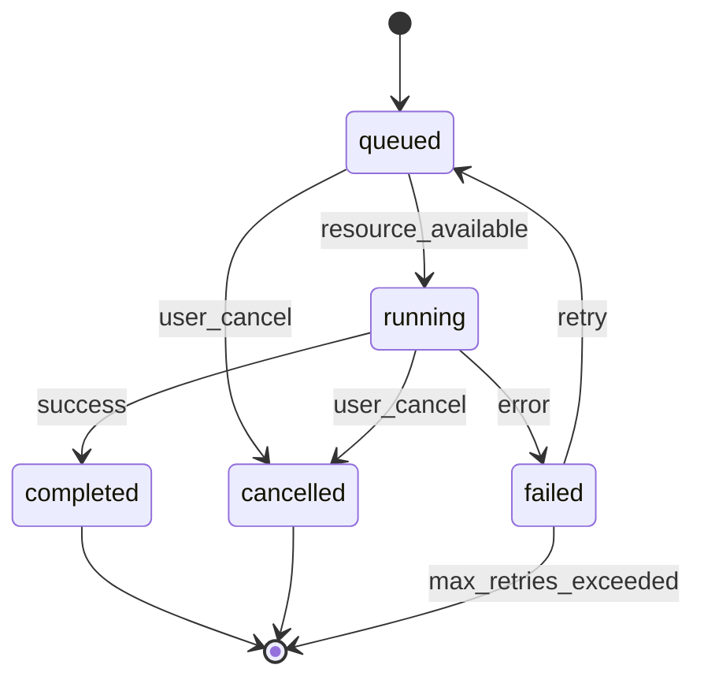
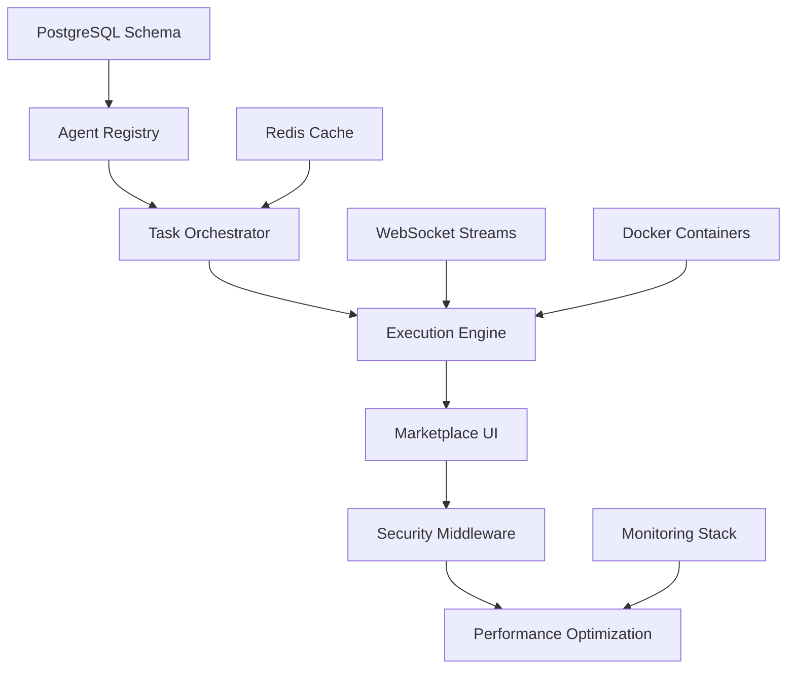

Excellent — let’s generate a **developer-ready blueprint** directly aligned with your uploaded mind map and current CapeControl vision.
Below is your complete **`/docs/agents/ARCHITECTURE_BLUEPRINT.md`** draft (ready to commit).

---

# 🧭 CapeControl Agent Architecture Blueprint

**Document purpose:**
Define the end-to-end structure, lifecycle, and integration flow of the CapeControl Agent System — uniting the concepts from the *agents-free.mm* mind map with the live FastAPI + React + PostgreSQL stack.

---

## 1. 🎯 Overview

CapeControl’s Agent Framework enables intelligent, composable, and safe automation.
Each **agent** is a modular AI or service component registered through the Agent Gateway, discoverable via the Marketplace, and callable through an orchestration API.

**Core goals**

* Democratize access to AI functions (onboarding → finance → IoT → devops).
* Provide transparent versioning, permissions, and auditable execution.
* Allow plug-and-play publication of third-party agents.

---

## 2. 🧩 Agent Taxonomy

| Tier                        | Example Agents                                                                     | Core Purpose                                                                       |
| --------------------------- | ---------------------------------------------------------------------------------- | ---------------------------------------------------------------------------------- |
| **AI-Assisted Agents**      | `CapeAIGuide`, `DevAgent`, `CustomerAgent`, `ChatAgentKitRuntime`                  | Contextual guidance, onboarding, adaptive assistance, conversational flows.        |
| **Domain-Specific Agents**  | `FinanceAgent`, `EnergyAgent`                                                      | Handle specialized business or IoT domains: payments, smart-meter data, reporting. |
| **Middleware-Bound Agents** | `SecurityAgent`, `AuditLogging`, `Monitoring`, `Sanitization`, `ContentModeration` | Protect, log, and govern all agent activity across the platform.                   |

---

## 3. 🧠 Agent Lifecycle

```
Create → Develop → Version → Publish → Install → Use → Update
```

### 3.1 Create

* **Endpoint:** `POST /agents`
* System assigns slug and sets initial state = `draft`.

### 3.2 Develop & Test

* Implement logic in `backend/src/agents/{agent_name}.py`
* Generate manifest (`manifest.json`)
* Validate via `/agents/{id}/validate`

### 3.3 Version

* **Endpoint:** `POST /agents/{id}/versions`
* Manifest attached and semver applied (Major.Minor.Patch)
* State: `draft`

### 3.4 Publish

* **Endpoint:** `POST /agents/{id}/versions/{ver}/publish`
* Performs manifest + dependency validation.
* State: `published`
* Becomes discoverable in Marketplace.

### 3.5 Install

* One-click install downloads manifest, checks compatibility, requests permission grants.

### 3.6 Use

* Invoked via `POST /api/agents/{agent_id}/tasks`
* Executed by **Agent Gateway** and audited.

### 3.7 Update / Archive

* New version supersedes prior; old versions move to `archived`.

---

## 4. 🧱 Data Models (PostgreSQL)

```sql
-- Core agent registry
CREATE TABLE agents (
  id TEXT PRIMARY KEY,
  name TEXT NOT NULL,
  slug TEXT UNIQUE NOT NULL,
  description TEXT,
  category TEXT,
  capabilities JSONB,
  policy_scopes TEXT[],
  manifest JSONB,
  status TEXT DEFAULT 'draft',
  created_at TIMESTAMPTZ DEFAULT now(),
  updated_at TIMESTAMPTZ DEFAULT now()
);

-- Agent version management
CREATE TABLE agent_versions (
  id UUID PRIMARY KEY DEFAULT gen_random_uuid(),
  agent_id TEXT REFERENCES agents(id) ON DELETE CASCADE,
  version TEXT NOT NULL,
  manifest JSONB NOT NULL,
  status TEXT CHECK (status IN ('draft','published','archived')) DEFAULT 'draft',
  published_at TIMESTAMPTZ,
  created_at TIMESTAMPTZ DEFAULT now(),
  UNIQUE(agent_id, version)
);

-- Task execution tracking
CREATE TABLE tasks (
  id UUID PRIMARY KEY DEFAULT gen_random_uuid(),
  user_id TEXT NOT NULL,
  agent_id TEXT REFERENCES agents(id),
  goal TEXT,
  input JSONB,
  status TEXT DEFAULT 'queued' CHECK (status IN ('queued','running','completed','failed','cancelled')),
  started_at TIMESTAMPTZ,
  completed_at TIMESTAMPTZ,
  error_message TEXT,
  created_at TIMESTAMPTZ DEFAULT now()
);

-- Step-by-step execution details
CREATE TABLE runs (
  id UUID PRIMARY KEY DEFAULT gen_random_uuid(),
  task_id UUID REFERENCES tasks(id) ON DELETE CASCADE,
  step INT NOT NULL,
  state JSONB,
  status TEXT CHECK (status IN ('pending','running','completed','failed')),
  started_at TIMESTAMPTZ,
  finished_at TIMESTAMPTZ,
  error_details JSONB,
  UNIQUE(task_id, step)
);

-- Comprehensive audit trail
CREATE TABLE audit_events (
  id BIGSERIAL PRIMARY KEY,
  task_id UUID REFERENCES tasks(id) ON DELETE SET NULL,
  agent_id TEXT REFERENCES agents(id) ON DELETE SET NULL,
  user_id TEXT,
  event_type TEXT NOT NULL,
  payload JSONB,
  ip_address INET,
  user_agent TEXT,
  created_at TIMESTAMPTZ DEFAULT now()
);

-- Performance indexes
CREATE INDEX idx_agents_status ON agents(status);
CREATE INDEX idx_agents_category ON agents(category);
CREATE INDEX idx_agent_versions_agent_id ON agent_versions(agent_id);
CREATE INDEX idx_agent_versions_status ON agent_versions(status);
CREATE INDEX idx_tasks_user_id ON tasks(user_id);
CREATE INDEX idx_tasks_status ON tasks(status);
CREATE INDEX idx_tasks_agent_id ON tasks(agent_id);
CREATE INDEX idx_tasks_created_at ON tasks(created_at DESC);
CREATE INDEX idx_runs_task_id ON runs(task_id);
CREATE INDEX idx_audit_events_agent_id ON audit_events(agent_id);
CREATE INDEX idx_audit_events_created_at ON audit_events(created_at DESC);
CREATE INDEX idx_audit_events_event_type ON audit_events(event_type);

-- Triggers for updated_at
CREATE OR REPLACE FUNCTION update_updated_at_column()
RETURNS TRIGGER AS $$
BEGIN
    NEW.updated_at = now();
    RETURN NEW;
END;
$$ language 'plpgsql';

CREATE TRIGGER update_agents_updated_at BEFORE UPDATE ON agents
FOR EACH ROW EXECUTE FUNCTION update_updated_at_column();
```

---

## 5. ⚙️ FastAPI Components

### 5.1 Agent Registry (`registry.py`)

* Stores and exposes all active `AgentSpec` objects.
* Used by `/api/agents` routes.

### 5.2 Agent Router (`agent_router.py`)

* `GET /api/agents` – list registered agents
* `POST /api/agents/{id}/tasks` – run agent task
* `GET /api/agents/tasks/{task_id}` – poll or stream status

### 5.3 Orchestrator (`task_runner.py`)

* Executes `AgentSpec.run()`
* Handles multi-step plan execution
* Persists each step in `runs`
* Triggers `audit_events`

### 5.4 Agent Execution Engine (`execution_engine.py`)

* **Isolation**: Each agent runs in containerized environment (Docker/podman)
* **Resource Limits**: CPU/memory quotas per agent type (configurable via manifest)
* **Timeout Handling**: Max execution time policies (default 30s, configurable up to 300s)
* **Error Recovery**: Exponential backoff retry strategies with circuit breaker patterns
* **Health Monitoring**: Continuous resource usage and performance tracking

### 5.5 Configuration Manager (`config_manager.py`)

* **Manifest Validation**: JSON schema validation against agent specifications
* **Environment Management**: Secure injection of environment variables and secrets
* **Dependency Resolution**: Package and service dependency checking
* **Policy Enforcement**: Runtime validation of policy scopes and permissions

---

## 6. 🧩 Pydantic Schemas

| Schema               | Purpose                                         | Notes           |
| -------------------- | ----------------------------------------------- | --------------- |
| `AgentBase`          | Core model (name, description, manifest, slug)  | Required fields |
| `AgentCreate`        | Extends base; adds validation + slug generation | POST body       |
| `AgentUpdate`        | Partial updates                                 | PATCH           |
| `AgentVersionBase`   | Manifest + version + status enum                | Internal        |
| `AgentVersionCreate` | Validates manifest completeness                 | For /versions   |

*(From mind map section "Agent Schemas" & "Version Schemas".)*

### 6.1 Agent Configuration Schema

```yaml
# manifest.json structure
{
  "name": "string (required)",
  "version": "semver (required)",
  "description": "string (required)", 
  "placement": "chat|dashboard|workflow|background",
  "category": "ai-assisted|domain-specific|middleware|utility",
  "tools": ["tool1", "tool2"],
  "dependencies": {
    "python": ">=3.9",
    "packages": ["fastapi>=0.104.0", "pydantic>=2.0.0"],
    "services": ["redis", "postgresql"]
  },
  "config": {
    "timeout": 30,
    "retries": 3,
    "memory_limit": "512MB",
    "cpu_limit": "0.5",
    "concurrent_tasks": 5
  },
  "permissions": {
    "scopes": ["profile:read", "finance:write"],
    "required_roles": ["user", "premium"],
    "data_access": ["user_data", "system_metrics"]
  },
  "triggers": {
    "events": ["user.onboard", "payment.completed"],
    "schedules": ["0 9 * * MON", "0 */6 * * *"],
    "webhooks": ["/api/agents/{id}/webhook"]
  },
  "ui": {
    "icon": "🤖",
    "color": "#3B82F6", 
    "description_short": "Brief agent purpose",
    "settings_schema": {
      "type": "object",
      "properties": {
        "api_key": {"type": "string", "secret": true},
        "threshold": {"type": "number", "default": 0.8}
      }
    }
  }
}
```

---

## 7. 🪄 Marketplace & Discovery Flow

1. **Browse** – list view with metadata, filters, categories.
2. **Detail View** – show description, manifest excerpt, changelog.
3. **Install** – one-click install, permission configuration, dependency checks.
4. **Version Management** – Draft → Published → Archived; auto semver bump.

> Front-end: React dashboard powered by `/api/agents` and `/api/agents/{id}/versions`.

---

## 8. 🔐 Middleware & Policy Agents

| Middleware Agent     | Function                        |
| -------------------- | ------------------------------- |
| `SecurityAgent`      | Rate limiting, abuse prevention |
| `InputSanitization`  | Filter malicious payloads       |
| `ContentModeration`  | Check generated outputs         |
| `AuditLogging`       | Persistent event trail          |
| `PerformanceMonitor` | Latency, error metrics          |

> Each wraps requests to other agents through **policy scopes** (`payments:manage`, `profile:write`, etc.).

---

## 9. 🧩 Example Agent Specs

### CapeAIGuide

```
Purpose: contextual onboarding & feature discovery
Tools: ask_user(), generate_checklist(), summarize_feedback()
Policy scopes: ["profile:write", "checklist:write"]
```

### FinanceAgent

```
Purpose: handle budget tracking, payment processing
Tools: ingest_transactions(), generate_report(), initiate_payment()
Policy scopes: ["finance:read", "finance:write", "payments:manage"]
```

### EnergyAgent

```
Purpose: connect to Tuya smart meter, analyze usage
Tools: get_usage_data(), optimize_consumption(), alert_threshold()
Policy scopes: ["iot:read", "iot:optimize"]
```

---

## 9. 🧰 Orchestration Flow (runtime)

```
[Frontend: user action]
      ↓
POST /api/agents/{agent_id}/tasks
      ↓
Agent Gateway
  ├─ Policy validation
  ├─ Middleware (security, audit)
  ├─ Run orchestrator (plan/act/observe)
  └─ Emit stream (WebSocket/SSE)
      ↓
Frontend UI renders live results
```

### 9.1 Error Categories & Response Handling

| Error Category        | HTTP Status | Response Strategy                | User Experience                |
| -------------------- | ----------- | -------------------------------- | ------------------------------ |
| **Validation Errors** | 400        | Invalid manifest/input → detailed error messages | Show field-specific validation errors |
| **Permission Errors** | 403        | Insufficient scopes → required permissions list | Prompt for permission upgrade |
| **Resource Errors**   | 503        | Timeout/memory → retry with exponential backoff | Show retry countdown with cancel option |
| **Agent Errors**      | 500        | Internal failures → automatic retry with circuit breaker | Fallback to simplified flow |
| **Rate Limit Errors** | 429        | Too many requests → retry after delay | Show rate limit reset time |

### 9.2 Task Execution States



### 9.3 Performance & Scalability Patterns

* **Agent Pool Management**: Pre-warm popular agents in memory pool
* **Caching Strategy**: Redis for manifest/results caching (TTL: 15 min)
* **Queue Management**: Redis-based task queue with priority levels
* **Database Optimization**: Read replicas for marketplace queries, connection pooling
* **Load Balancing**: Round-robin across agent execution nodes
* **Circuit Breaker**: Auto-disable failing agents, gradual recovery

---

## 10. 📊 KPIs & Metrics

| Metric                | Target   | Description                                    | Measurement Method |
| --------------------- | -------- | ---------------------------------------------- | ------------------ |
| Time-to-Value         | < 10 min | From signup to first checklist completion      | User journey tracking |
| Playbook Success Rate | ≥ 90 %   | Steps completed without human help             | Task completion analytics |
| P90 Run Latency       | < 12 s   | Task execution performance                     | Application performance monitoring |
| Agent Availability    | ≥ 99.5%  | Agent uptime and responsiveness                | Health check monitoring |
| Conversion Rate       | ↑        | Free → SuperGrok upgrades                      | Funnel analysis |
| MTTR                  | < 15 min | Mean time to resolve incidents via Ops Copilot | Incident tracking |
| User Satisfaction     | ≥ 4.2/5  | Agent usefulness and reliability ratings       | In-app feedback system |

### 10.1 Performance Monitoring Dashboard

```yaml
# Grafana/Prometheus metrics
agent_execution_duration_seconds: histogram
agent_success_rate: gauge
agent_concurrent_tasks: gauge
agent_memory_usage_bytes: gauge
agent_cpu_usage_percent: gauge
task_queue_depth: gauge
user_satisfaction_score: gauge
marketplace_discovery_rate: counter
```

### 10.2 Alerting Thresholds

* **High Priority**: Agent failure rate > 5%, P95 latency > 30s
* **Medium Priority**: Queue depth > 1000, Memory usage > 80%
* **Low Priority**: User satisfaction < 4.0, Discovery rate decline > 20%

---

## 11. 🧭 Implementation Roadmap

### Phase 1: Foundation (Weeks 1-3)

* **Agent Registry + Basic CRUD**
  * PostgreSQL schema setup with migrations
  * FastAPI agent router with CRUD endpoints
  * Pydantic schemas and validation
  * Basic manifest validator
* **Deliverable**: Agent creation and listing functionality

### Phase 2: Core Execution (Weeks 4-6)  

* **Orchestrator + Task Runner**
  * Task execution engine with isolation
  * Multi-step plan execution
  * Basic error handling and retries
  * WebSocket streaming for real-time updates
* **Deliverable**: Agent execution with live progress tracking

### Phase 3: Marketplace & Discovery (Weeks 7-9)

* **Discovery UI + Install Flow**
  * React marketplace interface
  * Agent detail pages with manifest preview
  * One-click installation with permission configuration
  * Version management and upgrade flows
* **Deliverable**: End-to-end agent discovery and installation

### Phase 4: Security & Governance (Weeks 10-12)

* **Middleware Integration + Policy Engine**
  * Security agents (rate limiting, input sanitization)
  * Audit logging with event tracking
  * Policy scope validation and enforcement
  * Content moderation and safety checks
* **Deliverable**: Production-ready security and compliance

### Phase 5: Scale & Optimize (Weeks 13-16)

* **Performance Optimization + Analytics**
  * Redis caching and queue management
  * Database read replicas and connection pooling
  * Monitoring dashboard with Grafana/Prometheus
  * Load balancing and horizontal scaling
* **Deliverable**: High-performance, scalable agent platform

### 11.1 Technical Dependencies



## 12. 🔧 Development Setup

### 12.1 Local Environment Requirements

```bash
# Core infrastructure
docker-compose up -d postgres redis

# Python environment
python -m venv venv
source venv/bin/activate
pip install -r requirements-agents.txt

# Database setup
alembic upgrade head
python scripts/seed_sample_agents.py

# Start development servers
uvicorn backend.src.app:app --reload --port 8000
cd client && npm run dev
```

### 12.2 Agent Development Toolkit

```python
# Agent SDK for rapid development
from capecontrol.agents import AgentBase, task, tool

class ExampleAgent(AgentBase):
    @task("Process user request")
    async def handle_request(self, input_data: dict) -> dict:
        result = await self.execute_steps([
            self.validate_input,
            self.process_data, 
            self.generate_response
        ])
        return result
    
    @tool("Validate input parameters")
    async def validate_input(self, data: dict) -> bool:
        # Implementation here
        pass
```

---

### ✅ Summary

This blueprint operationalizes your *capecontrol-agents-system.mm* structure with production-ready enhancements:

* **Robust Data Architecture**: Enhanced PostgreSQL schema with proper indexes and constraints
* **Comprehensive Error Handling**: Detailed error categories with appropriate response strategies  
* **Performance & Scalability**: Redis caching, connection pooling, and horizontal scaling patterns
* **Security & Compliance**: Multi-layer middleware with audit trails and policy enforcement
* **Developer Experience**: Clear implementation roadmap with practical development toolkit
* **Operational Excellence**: Monitoring, alerting, and performance optimization strategies

The architecture aligns directly with CapeControl's vision of **adaptive, accessible, intelligent AI-agents** while providing enterprise-grade reliability and scalability.

### 🚀 Ready for Implementation

**Next immediate actions:**
1. Review and approve the enhanced architecture
2. Set up development environment using provided setup guide
3. Begin Phase 1 implementation with PostgreSQL schema creation
4. Establish CI/CD pipeline for agent validation and deployment

---

**Implementation Support Available:**
* Ready-to-run code stubs for `registry.py`, `agent_router.py`, and example agents
* Database migration scripts with proper indexing strategy  
* Docker compose setup for local development environment
* Monitoring dashboard configuration templates
